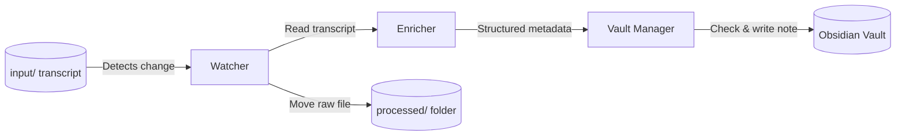
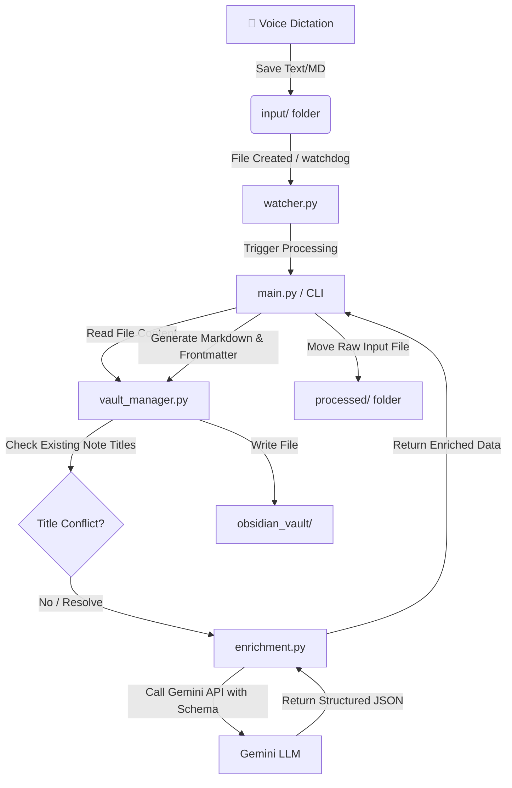

# Voice-First Idea Capture & Obsidian Ingestion Pipeline

A collaborative project to build a local-first automation pipeline that ingests raw voice-dictation transcripts, enriches them with LLM metadata, and stores them in Obsidian.

## 🗺️ Project Scope
- **Ingestion Pipeline**: Watches or scans an `input/` folder for text files (`.txt` or `.md`).
- **LLM Enrichment**: Leverages the Gemini API to analyze the raw notes, generate structured YAML metadata (adhering to a Pydantic schema for categorization, status, effort, next actions, etc.), and summarize the core ideas.
- **Vault Management**: Formats the enriched data as Markdown, checks for existing title conflicts, and writes the notes to an Obsidian vault.
- **Archiving**: Moves processed raw inputs to a `processed/` directory.

## 🔄 Ingestion Pipeline Flow

### High-Level Conceptual Flow


### Detailed Component Flow


## 📂 Directory Structure
- `src/`: Core Python pipeline source files.
  - [main.py](file:///Users/fanibhushan/voice-idea-capture/src/main.py): CLI interface entry point.
  - [config.py](file:///Users/fanibhushan/voice-idea-capture/src/config.py): Configures paths, environment variables, and ensures directory existence.
  - [watcher.py](file:///Users/fanibhushan/voice-idea-capture/src/watcher.py): Uses `watchdog` to monitor folders and trigger processing callbacks.
  - [enrichment.py](file:///Users/fanibhushan/voice-idea-capture/src/enrichment.py): Contains LLM schema validation and Gemini API wrapper.
  - [vault_manager.py](file:///Users/fanibhushan/voice-idea-capture/src/vault_manager.py): Handles title checking and markdown note writing.
- `input/`: Folder where new dictations should be placed.
- `processed/`: Archive directory for completed input transcripts.
- `obsidian_vault/`: Default destination path for Obsidian markdown notes.

## ⚙️ Setup & Configuration
1. Initialize virtual environment:
   ```bash
   python3 -m venv .venv
   source .venv/bin/activate
   pip install -r requirements.txt
   ```
2. Copy environment settings and specify API credentials:
   ```bash
   cp .env.example .env
   # Add your GEMINI_API_KEY inside the .env file
   ```

## 🚀 CLI Commands
- **Process pending inputs once**:
  ```bash
  .venv/bin/python src/main.py run
  ```
- **Watch directory in real-time**:
  ```bash
  .venv/bin/python src/main.py watch
  ```
- **Check current pipeline status**:
  ```bash
  .venv/bin/python src/main.py status
  ```
