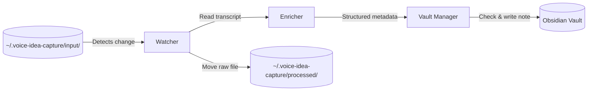
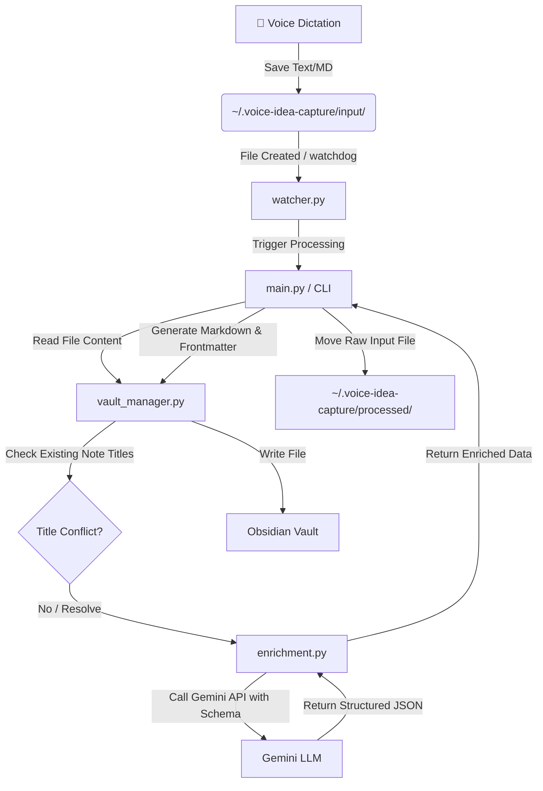

# Voice-First Idea Capture & Obsidian Ingestion Pipeline

A collaborative project to build a local-first automation pipeline that ingests raw voice-dictation transcripts, enriches them with LLM metadata, and stores them in Obsidian.

## 🗺️ Project Scope
- **Ingestion Pipeline**: Watches or scans the hidden input directory `~/.voice-idea-capture/input` for text files (`.txt` or `.md`).
- **LLM Enrichment**: Leverages the Gemini API to analyze the raw notes, generate structured YAML metadata (adhering to a Pydantic schema for categorization, status, effort, next actions, etc.), and summarize the core ideas.
- **Vault Management**: Formats the enriched data as Markdown, checks for existing title conflicts, and writes the notes to your Obsidian vault.
- **Archiving**: Moves processed raw inputs to `~/.voice-idea-capture/processed/`.

## 🔄 Ingestion Pipeline Flow

### High-Level Conceptual Flow


### Detailed Component Flow



## ⚙️ Setup & Configuration
1. Initialize virtual environment and install the package:
   ```bash
   python3 -m venv .venv
   source .venv/bin/activate
   pip install -e .
   ```
2. Copy environment settings and specify API credentials:
   ```bash
   cp .env.example .env
   # Add your GEMINI_API_KEY inside the .env file
   ```

## 🚀 CLI Commands
The project is packaged with the custom CLI tool `idea-capture`. You can run these commands from the project root (using the virtualenv path `.venv/bin/idea-capture`) or globally if you activate the virtual environment (`source .venv/bin/activate`):

- **Sync and Process Notes**:
  ```bash
  .venv/bin/idea-capture run
  ```
  *(Automatically pulls `@idea` notes from Apple Notes, enriches them with Gemini, and saves them to Obsidian in one step).*

- **Watch directory in real-time**:
  ```bash
  .venv/bin/idea-capture watch
  ```

- **Check current pipeline status**:
  ```bash
  .venv/bin/idea-capture status
  ```

### ⚙️ Command Line Options
You can override any environment configuration paths directly using CLI flags:
* `--input-dir` or `-i`: Override the input folder path.
* `--processed-dir` or `-p`: Override the processed archive folder path.
* `--vault-path` or `-v`: Override the destination Obsidian vault path.

*Example (run status check on a custom vault)*:
```bash
.venv/bin/idea-capture --vault-path ~/Documents/PersonalVault status
```

### 🍎 macOS Integration & Automation
* **Export Notes Manually**:
  If you want to manually run the export from Apple Notes without triggering the ingestion pipeline, you can run the AppleScript directly:
  ```bash
  osascript shortcuts/export_ideas.applescript
  ```

* **Global Access**:
  To run `idea-capture` globally from anywhere on your Mac, choose one of these options:

  **Option 1: Using pipx (Recommended)**
  `pipx` installs python CLI utilities in isolated environments and exposes them globally. Run this from the project root directory:
  ```bash
  # Install pipx (if you don't have it)
  brew install pipx
  pipx ensurepath
  
  # Install the package globally in editable mode
  pipx install --editable .
  ```
  *(Now the `idea-capture` command is available globally in any folder!)*

  **Option 2: Creating a Symlink**
  Symlink the virtual environment executable into a folder in your `$PATH` (like `/usr/local/bin`):
  ```bash
  ln -s /path/to/voice-idea-capture/.venv/bin/idea-capture /usr/local/bin/idea-capture
  ```

  **Option 3: Shell Alias**
  Add an alias to your shell config (e.g., `~/.zshrc`):
  ```bash
  echo 'alias idea-capture="/path/to/voice-idea-capture/.venv/bin/idea-capture"' >> ~/.zshrc
  source ~/.zshrc
  ```
